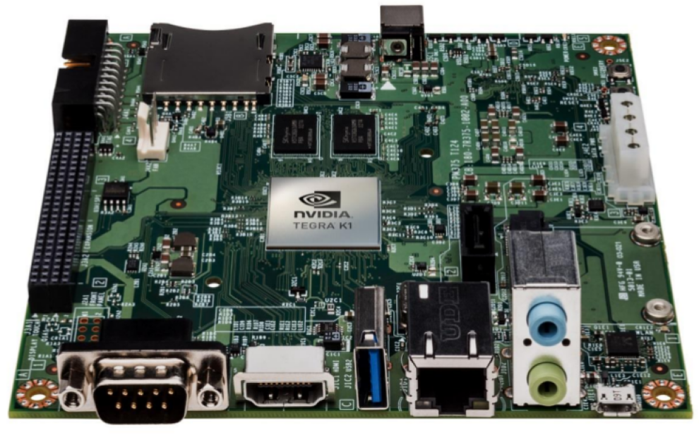

# Galaxeirb_Collision

## Présentation
Ce module a pour but d’implémenter une application de calcul mathéma- tiques intensif sur un système embarqué (System On Chip). L’application choisie consiste à simuler le déplacement de deux galaxies en fonction de leur gravitation. Il s’agit de la collision entre la voie lactée "Milky Way" et Andromède "Andromeda" qui, selon les observations actuelles, se produira dans approximativement quatre milliards d’années entre les deux plus grandes galaxies du Groupe local. Pour ce faire, on dispose d’une base données listant les composants des deux galaxies, leurs positions, leurs masses et leurs vélocités.
La carte de développement qui sera utilisé (Figure 1 )est une carte Nvi- dia Jetson K1 embarquant quatre coeurs de processeur Cortex A15 (architecture ARMv7) et 192 coeurs CUDA GK20A ainsi que 2GB de RAM.

  
       

<caption>**Figure 1 – Carte de développement NVIDIA Jetson TK1**</caption>

Le développement s’effectuera en plusieurs étapes. Tout d’abord une im- plémentation basique des algorithmes de calculs. Ensuite, on procédera à une opti- misation algorithmique concentré dans un premier temps sur le CPU puis dans un second temps sur l’utilisation du GPU. Afin de réaliser ce projet, nous avons à notre disposition plusieurs librairies tel que SDL, OpenGL, OpenMP, CUDA, etc.

## Auteurs
Ce projet a été réaliser dans le cadre d'un projet de l'ENSEIRB-MATMECA. Nous sommes deux étudiants de la fillière SE 3A.
* Ayoub MOUHAGIR
* Abdessamad FERIAT

## Fichier Dubinski
Les informations concernant les entités (Masse, position, vélocité) sont stockées dans les fichiers ./ressources/dubinskiX.tab où X est un chiffre qui indique le nombre d'entité contenues dans le fichier.

| Indicateur | NB entités |
| --------- | --- |
| 1 | 81920 |
| 2 | 1025 |
| 3 | 962 |
| 4 | 10241 |
| 5 | 5121 |
| 6 | 3 |
| 7 | 128 |

## Les commandes
L'interface utilisateur est dotée de plusieurs commande qui permettent d'interagir avec le programme, voici la liste :
* F1 : Affiche/cache le repère
* F2 : Affiche/cache la grille
* F3 : Affiche/cache les entités
* F4 : Cache la grille et le repère puis ajuste la caméra au centre du monde
* F6 : Fige/démarre la collision intergalactique
* F7 : Affiche/cache les historiques des entités
* F12 : Mode de contrôle camera Star Wars (Libère les contrainte caméra et autorise les lancés de blaster)
* D/Q/Z/S : Déplacement horizontal de la caméra
* N/B : Déplacement vertical de la caméra
* A : Passe la caméra en orbite 
* ESC : Quitte l'application

## D'autres détails dans le rapport.
